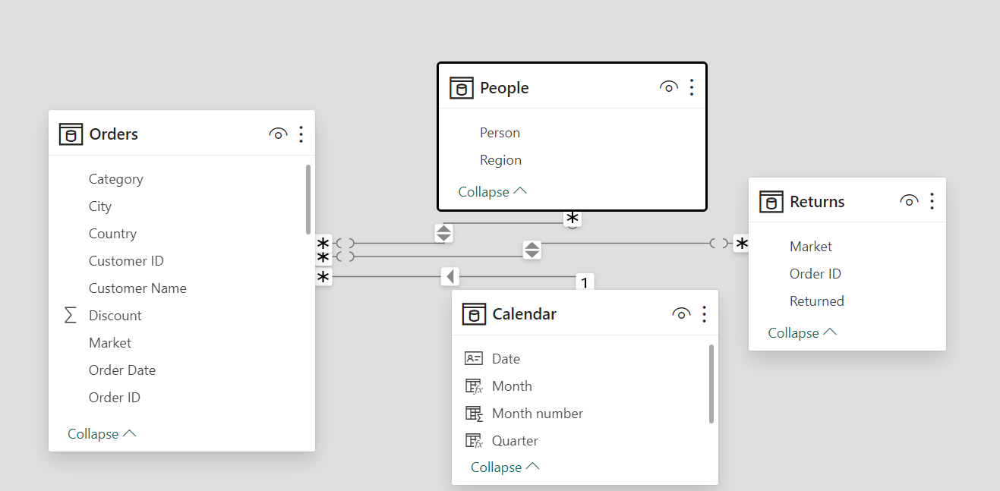

# Global Superstore

## Introduction

This is a Power BI project on Global Superstore which is a global online retailer based in New York, boasting a broad product catalog and aiming to be a one-stop-shop for its customers. The superstore’s clientele, hailing from 147 different countries, can browse through an endless offering with more than 10,000 products. This large selection comprises three main categories: office supplies (e.g., staples), furniture (e.g., chairs), and technology (e.g., smartphones).

## Problem Statement

The project is to help Global Superstore analyze and draw out meaningful insight from the Superstore dataset which would aid management in making informed decisions to improve performance and profitability.

## Skills/concepts demonstrated:

The following Power BI features were incorporated;
DAX, quick measures, filtering, data modeling, tooltips.

## Data Sourcing

Click [here](https://docs.google.com/spreadsheets/d/1nxESpFzWjlGDMGDVLH69xmDzIl9l6OEq/edit#gid=633280281)

## Data Transformation

A new table called _Calendar_  was created using DAX to derived day, month and year from the date column given.

## Modeling

Automatically derived relationships were adjusted to remove and replace unwanted relationships from the desired relationships.

## Analysis/Visualization

1a. What are the three countries that generated the highest total profit for Global Superstore in 2014?

In 2014, the top three countries with the highest total profit are United States ($93,508), India ($48,808) and China ($46,794).

1b.	For each of these three countries, find the three products with the highest total profit. Specifically, what are the products’ names and the total profit for each product?

•	United States

Canon imageCLASS 2200 Advance Copier - $15,680

Hewlett Packard Laserjet 3310 Copier - $3,624

GBC DocuBind TL300 Electric Binding System - $1,911

•	India

Sauder Classic Bookcase, Traditional - $2,420

CISCO Smart Phone, with Caller ID - $1,609

Hamilton Beach Refrigerator, Red - $1,440

•	China

Sauder Classic Bookcase, Metal - $2,420

Bush Classic Bookcase, Mobile	- $1,221

HP Copy Machine, Color - $1,196

United States          |    India      |   China
-----------------------|---------------|------------------
 | |

2. Identify the 3 subcategories with the highest average shipping cost in the United States.
	
 The subcategories with the highest average shipping cost in United States are
• Copiers – 165.29
• Machines – 132.25
• Tables – 69.95

3a. Assess Nigeria’s profitability (i.e., total profit) for 2014. How does it compare to other African countries?

In 2014, Nigeria’s profitability compared to other African countries is the lowest with a total profit of -$23,285. This means that in 2014, Nigeria was at a huge loss.

b. What factors might be responsible for Nigeria’s poor performance? 

Nigeria’s poor performance was due to their relatively high shipping cost and discount rate. The shipping cost averaged at about $5.50 which is the second highest shipping cost in Africa and the discount rate average at about 0.70 which is amongst the highest in the world.

4a. Identify the product subcategory that is the least profitable in Southeast Asia.

The least profitable subcategory in Southeast Asia is Tables with a total profit of -$18,618 which is a huge loss.

b. Is there a specific country in Southeast Asia where Global Superstore should stop offering the subcategory?

Global Superstore should stop offering the Tables subcategory to Indonesia because it made a total profit of -$10,680 which is the highest by a large margin.

5a. Which city is the least profitable (in terms of average profit) in the United States?

The least profitable city in United States that is **Lancaster** with an average profit of -$179.

b. Why is this city’s average profit so low?

Lancaster’s average profit is so low because it has a very high average shipping cost of about $25.54

6. Which product subcategory has the highest average profit in Australia?

In Australia, the subcategory with the highest average profit is _Appliances_ with an average profit of $139.

7. Who are the most valuable customers and what do they purchase?

The top 3 most valuable customers are;

• Tamara Chand - Canon imageCLASS 2200 Advance Copier for $8,400

• Raymond Buch - Canon imageCLASS 2200 Advance Copier for $6,720

• Sanjit Chand – Ibico EPK-21 Electric Binding System for $4,630

Tamara Chand   |   Raymond Buch  |   Sanjit Chand
---------------|-----------------|---------------
   |     |

## Conclusion/Recommendation

To increase performance and profitability, Global Superstores should reduce their discount in Nigeria and stop selling the subcategory Tables to Indonesia since they are at a loss.

